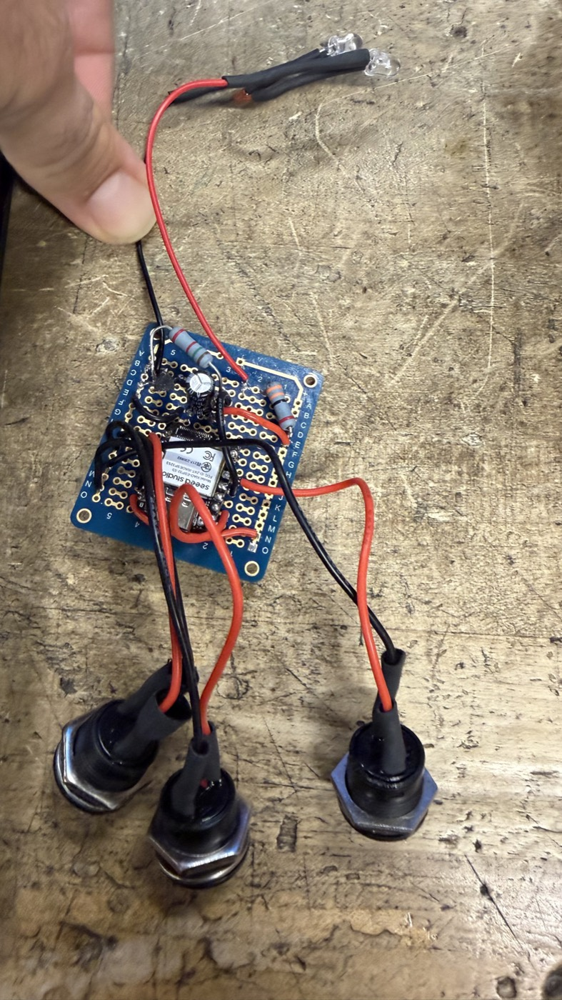
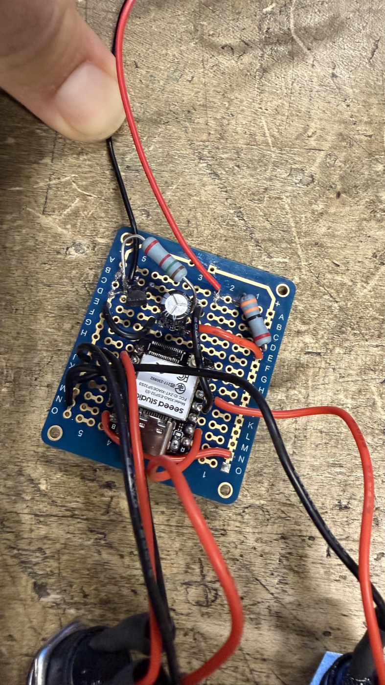

# IR-Remote

**A three-button universal IR remote you program from your phone** — an ESP32-S3
blasts the infrared code, and a web page (no app store, no build step) tells it
which code to blast over Bluetooth.

<p align="center">
  
  
</p>

The point is the last-mile problem in AV work: you're standing in front of an
unlabelled projector or a hotel TV with no remote, and you need power and input
switching *now*. This is a Flipper Zero's universal-remote trick, on $10 of parts,
in a form factor with real buttons you can hit without looking.

## Try it

**→ [koontzie.github.io/ir-remote/app/](https://koontzie.github.io/ir-remote/app/)**

The app is a single static HTML file with no dependencies and no backend. It talks
to the board with **Web Bluetooth**, which means:

- **Desktop Chrome / Edge / Android Chrome** — works as-is.
- **iOS: you need [Bluefy](https://apps.apple.com/us/app/bluefy-web-ble-browser/id1492822055).**
  Not a preference — **Safari has no Web Bluetooth support at all**, and every iOS
  browser is Safari underneath except the handful that ship their own BLE bridge.
  Bluefy is one of those. Open the link above inside Bluefy.
- **Firefox** — no Web Bluetooth. Won't work.

Without hardware you can still browse the code library; the connect button is the
only thing that needs a board.

## How it works

```
[phone or laptop browser]  ──Web Bluetooth──▶  [ESP32-S3 · BLE GATT]
                                                     │  writes to NVS (flash)
[3 physical buttons] ──GPIO──▶ [firmware] ──▶ [2N2222 ──▶ 2× IR LED] ──▶ device
```

Assign a code to a slot once, and the board **keeps it through a power cycle and
fires it with the browser completely disconnected.** It's a real remote, not a
Bluetooth accessory — the phone is a programming tool, not a dependency.

The code library ships in the repo: **317 brands, ~11,100 codes** across TVs,
projectors, monitors, AV receivers, soundbars, cable boxes, Blu-ray and DVD.
Search a brand, pick a function, assign it to a button. Codes shared across many
models of a brand are flagged as "blanket" codes and floated to the top, because
those are the ones most likely to just work.

**GATT interface** (device name `IR-Remote`):

| Role | UUID | Payload |
|---|---|---|
| service | `b457c32b-22b1-425f-8a88-4d6dc37ba4eb` | — |
| `config` (write) | `d997012d-7d2b-47de-ae87-bae14df446ef` | `{"slot":1,"proto":"SAMSUNG","code":"0xE0E040BF","bits":32}` |
| `trigger` (write) | `58397514-04a3-4265-9590-9d910c4e99d2` | `{"slot":1}` |
| `status` (notify) | `b8ddfe01-519f-430d-bd4e-aba0dd852e2c` | `saved:N` / `sent:N` / `pressed:N` / `err:…` |

Five slots (1–5); protocols NEC, SAMSUNG, SONY.

⚠️ **The GATT server is unauthenticated** — anyone in Bluetooth range can write a
config or trigger a slot. That's fine for bench use and it's a deliberate
trade-off, not an oversight; NimBLE bonding would close it if this ever left the
workbench.

## Where it stands

**It works.** The core is built and proven on the bench: IR transmit across a room
(20–30 ft), programming over Bluetooth from the app, codes persisting in flash
through a power cycle, all three physical buttons, and the searchable code library
end to end — pick a Samsung power code in the browser, assign it to a button, and
the TV across the room turns off.

It's a finished thing that does its job. What follows is the honest edge of it,
not a to-do list I'm apologising for.

- **USB-powered.** The circuit runs off the dev board's 5 V pin, so it needs a
  cable or a USB battery pack. A battery-and-deep-sleep version was started and
  stopped after it cost a dev board — see the postmortem below.
- **Identify mode is written but unproven.** Sweeping power codes until the device
  reacts, plus favourites, is implemented in the app and firmware but has never
  been run against real hardware.
- **The custom PCB is designed, not fabricated.** `hardware/` has a complete
  KiCad project, placed and partly routed. Nothing has been sent to a fab, so
  nothing about it is proven.
- **Bluetooth link drops occasionally** (`reason 520`, supervision timeout).
  Annoying, not dangerous — the stored codes and the IR output were verified
  correct either side of every drop.

The unit in the photos is currently dead, and it's a good story rather than a sad
one: during the battery experiment a cheap boost converter's solder-blob voltage
selector let go, silently jumped to 9 V, and cooked the dev board's regulator. The
design was never at fault, a socketed dev board makes it a two-minute swap, and
the full postmortem — along with every other fault this project hit — is in
[docs/DEVLOG.md](docs/DEVLOG.md).

## What's next

No timeline and no promises — the project does what it was built to do. If I pick
it back up:

- **An enclosure.** It's loose boards and panel-mount buttons right now. This is
  the one thing that would turn it from a working circuit into something you'd
  actually carry to a job.
- **Prove out identify mode** on a fresh dev board — the sweep is the feature that
  makes it genuinely universal rather than a nice code browser.
- **Polish the app UI.** It's functional and fast, but it's plainly a tool built
  by one person for one person.

## Bill of materials

| Qty | Part | Notes |
|---|---|---|
| 1 | **Seeed Studio XIAO ESP32-S3** dev board | Any ESP32-S3 dev board works; this is what's pictured. **Socket it** — dev boards die, and a socket makes that a pull instead of a desolder. |
| 2 | IR LED, 940 nm | Wired in series. Salvaged from a dead remote here. Verify a salvaged emitter is actually IR — it glows violet-white on a phone camera. |
| 1 | 2N2222 NPN transistor, TO-92 | Any general-purpose NPN with ≥150 mA collector current. |
| 1 | 33 Ω resistor | LED current limit — sets the ~100 mA pulse. |
| 1 | 1 kΩ resistor | Transistor base. |
| 1 | 470 µF electrolytic capacitor | Bulk decoupling across the 5 V rail. Steadies the rail during LED pulses. |
| 3 | R13-507 16 mm momentary buttons | Panel-mount, solder lugs, no polarity. Any momentary SPST works. |
| 1 | Protoboard + hookup wire | |

Roughly $10–15 if you're buying everything, less if you're raiding a parts bin.

## Wiring

Full card with health checks and measured values: **[hardware/WIRING.md](hardware/WIRING.md)**.

```
POWER
  Dev board 5V pin ──► 5V rail
  Dev board GND    ──► GND rail
  470µF cap across the rails: (+) → 5V, (−) stripe → GND, near the driver.

IR DRIVER (2N2222, TO-92)
  5V rail ──33Ω──► LED1 anode(+)
  LED1(−) ──► LED2(+)                 [series pair, both 940nm]
  LED2(−) ──► COLLECTOR
  EMITTER ──► GND rail
  GPIO4 ──1kΩ──► BASE (middle leg)

BUTTONS (INPUT_PULLUP, pressed = LOW)
  GPIO5 ──► button ──► GND   → slot 1
  GPIO2 ──► button ──► GND   → slot 2
  GPIO7 ──► button ──► GND   → slot 3
```

Two things that cost real bench time here, so they're worth repeating:

- **Meter the transistor's legs; don't assume them.** E/C order varies by vendor
  for the same part number. In diode mode with the red probe on Base, the outer
  leg with the *higher* forward drop is the Emitter.
- **A resistor being present on the board is not the same as it being in the
  current path.** The 33 Ω must be in series with the LEDs, not in the cap's
  branch. Check continuity to the right *node*.

## Build and flash

Toolchain (macOS, Homebrew) — these exact versions are what's verified:

| | Version |
|---|---|
| `arduino-cli` | 1.5.1 |
| `esp32` core | 3.3.10 |
| IRremoteESP8266 | 2.9.0 |
| NimBLE-Arduino | 2.5.0 |
| ArduinoJson | 7.4.3 |

```sh
arduino-cli core install esp32:esp32
arduino-cli lib install IRremoteESP8266 NimBLE-Arduino ArduinoJson

arduino-cli board list      # the port number is NOT stable across replugs
arduino-cli compile --fqbn esp32:esp32:esp32s3:CDCOnBoot=cdc firmware/remote_ble
arduino-cli upload -p <PORT> --fqbn esp32:esp32:esp32s3:CDCOnBoot=cdc firmware/remote_ble

sleep 20 | arduino-cli monitor -p <PORT> -c baudrate=115200
```

`CDCOnBoot=cdc` is required — the S3 talks over native USB CDC, and serial stays
silent without it. `arduino-cli monitor` exits instantly if stdin is closed, hence
the `sleep 20 |` when scripting it.

`firmware/phase1_ir_test/` is a deliberately minimal known-good IR sketch — it
sends one hard-coded Samsung code every 3 seconds. When something stops working,
flash that first to prove the LED path before suspecting anything else.

### Running the app locally

```sh
cd app && python3 -m http.server 8000
```

Open `http://localhost:8000` in desktop Chrome. `localhost` counts as a secure
context, so Web Bluetooth works without HTTPS.

## Repository layout

| Path | What |
|---|---|
| `firmware/remote_ble/` | The real firmware — BLE GATT + IR + 5 NVS-backed slots |
| `firmware/phase1_ir_test/` | Minimal known-good IR sketch, kept as a bisect tool |
| `app/index.html` | The whole app. One file, vanilla JS, no build step |
| `data/` | Generated IR code database — see [data/README.md](data/README.md) |
| `tools/flipper_ir_convert.py` | Flipper `.ir` → IRremoteESP8266 JSON converter + scraper |
| `hardware/` | KiCad 10 PCB project (unfabricated) + the wiring card |
| `docs/` | Design docs and the development log |
| `PLAN.md` | The plan |
| `docs/DEVLOG.md` | A running log of what actually happened — including the failures, in detail |

### Docs

[Code library + Identify mode design](docs/DESIGN-code-library.md) ·
[PCB design](hardware/DESIGN-pcb.md) ·
[hardware working notes](hardware/README.md) ·
[the IR database](data/README.md)

`docs/DEVLOG.md` is worth a look if you're building one of these. It's a blow-by-blow
of every fault hit along the way and how each was actually diagnosed — a dev board
bricked by a boost converter that silently drifted to 9 V, a transistor installed
E/C-reversed, a BLE advertisement overflowing 31 bytes so the device name was
silently dropped, and a board stuck in ROM download mode that looked exactly like
dead firmware. Each entry ends with the lesson rather than just the fix.

## Credits / data sources

The IR code database is built from
**[Lucaslhm/Flipper-IRDB](https://github.com/Lucaslhm/Flipper-IRDB)**, released
under **[CC0-1.0](https://creativecommons.org/publicdomain/zero/1.0/)** — a public
domain dedication that asks nothing of anyone reusing it. It's credited here
anyway, because a community-maintained database of 300+ brands is a real piece of
work and saying so is good manners. See [data/README.md](data/README.md) for how
it's converted and regenerated.

The firmware stands on
[IRremoteESP8266](https://github.com/crankyoldgit/IRremoteESP8266) (despite the
name, first-class ESP32 support) and
[NimBLE-Arduino](https://github.com/h2zero/NimBLE-Arduino).

> **A note on history:** until 2026-07-31 this repo also contained two universal
> code lists taken from
> [DarkFlippers/unleashed-firmware](https://github.com/DarkFlippers/unleashed-firmware),
> which is **GPL-3.0**. Those files and everything derived from them were removed
> when the project adopted the MIT license, and the sweep lists were rebuilt from
> the CC0 database instead. **They are still present in earlier commits** — git
> history was not rewritten. Nothing in the current tree derives from them.

## License

[MIT](LICENSE) © 2026 Tyler Koontz.

## Support

If you found this useful, you can [buy me a coffee](https://ko-fi.com/tylerxkoontz).
